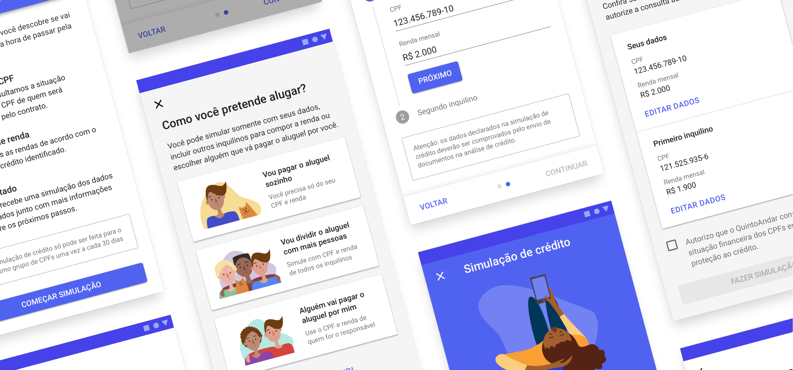
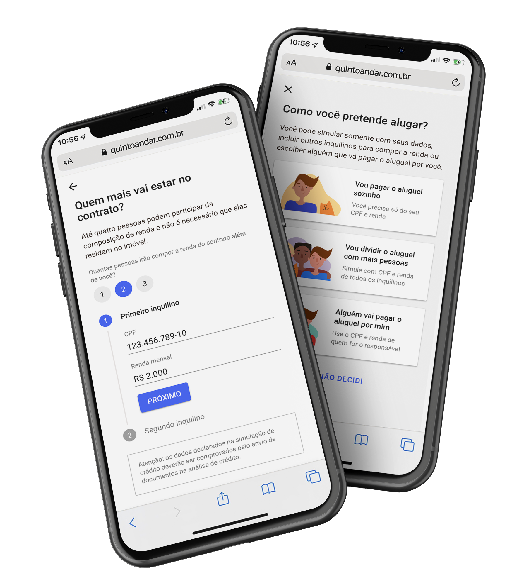
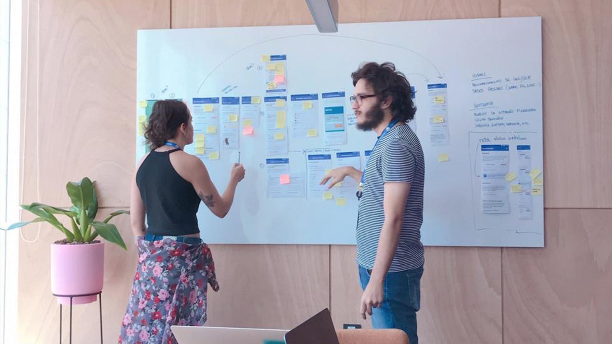
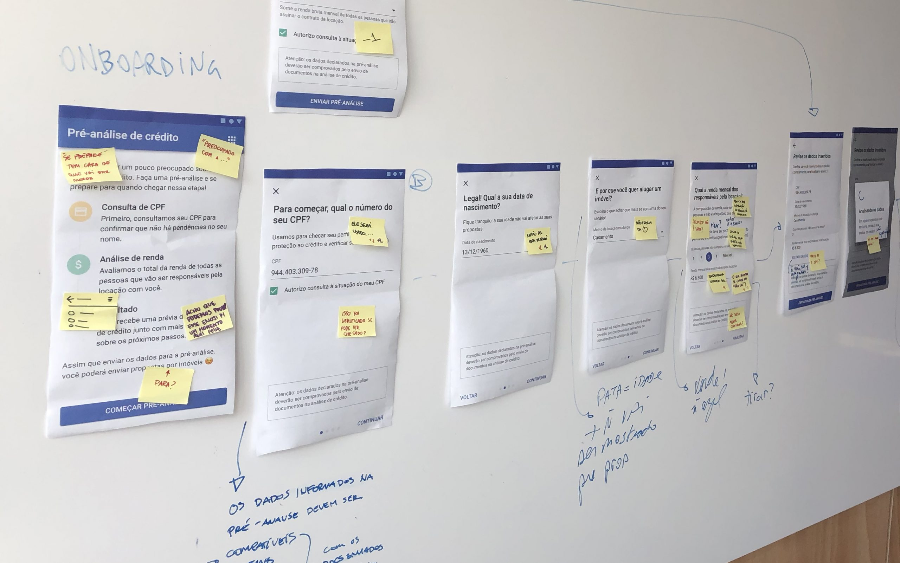
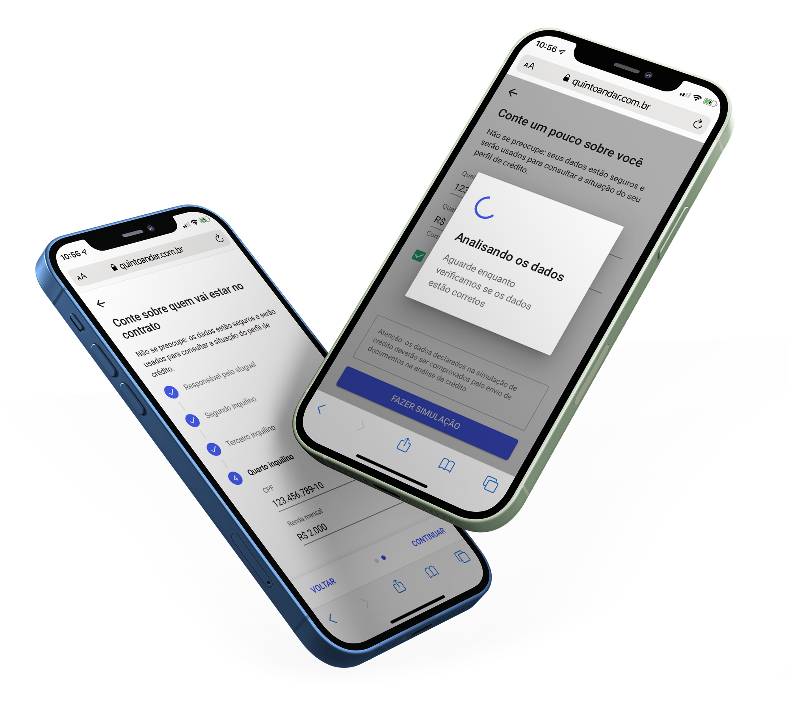

import { Grid } from "@material-ui/core"

<Grid container justify="center">

<Grid item lg={4}>

### Problem

People are missing out on their dream home because they get reject for credit.

</Grid>

<Grid item lg={4}>

### Solution

A way to easily prepare users to get approved for credit before commiting to a new home.

</Grid>

<Grid item lg={4}>

### Impact

Half of all users who applied for a lease after using the feature were approved for credit.

</Grid>

</Grid>

---

<Grid container justify="center">

<Grid item lg={8}>

One of QuintoAndar’s biggest selling points is protecting landlords with a guarantee that they will get their rent on time every month by approving tenants with only good credit scores.

However, a relevant portion of potential tenants were being rejected for credit, which meant a frustrating experience for them after applying, visiting and commiting to a new home.

Working at the Credit cross-functional team, our goal was to increase the number of tenants approved for credit while improving their experience.

</Grid>

<Grid item lg={12}>

</Grid>

<Grid item lg={8}>

A critical part of my role was to understand why and how we processed credit approvals with our operational credit teams, as well as identify user pain points such as what they were saying, how they were feeling, what they were thinking and what they were doing during this stage.

For that reason, I planned a two-fold discovery process, where I wanted to understand both perspectives on the problem.

1. Stakeholders interviews: semi-structured interviews with three analysts where I observed the approval process while asking them questions.

1. In-depth interviews: scripted, 15-minute phone calls with five tenants who had been denied for credit within the last 30 days.

</Grid>

<Grid item lg={12}>

</Grid>

<Grid item lg={8}>

Through these sessions, me and my product manager were able to come up with a few premisses for our solution. We defined that whatever we were building needed to:

1. Inform what are the types of proof of income we accepted, as users often tried to proof their income in unexpected ways, like sending photos of cash.

1. Reinforce that bureau credit scores were relevant for approval.

1. Educate how users can check their bureau credit score themselves.

1. Make it clear that users could add other people's incomes.

1. Help users understand credit approval criteria before booking visits.

Because of what we defined, we decided to build a sort of credit anticipation feature, which would offer users the opportunity to get an early result of their credit approval before sending any documents.
 
With that in mind, I started the solution with two basic steps:

1. Naming benchmarking: I analyzed how several players named credit related features, particularly fintechs.

1. User flow: before getting into any user interface design, I sat down to materialize what the entire feature would be like step-by-step to validate it with key stakeholders and engineering.

After these steps, we were certain that this was the right path to pursue, so I started prototyping the feature.

At this stage, I brought designers and end-users to validate the feature through a design critique with fellow product designers and a guerrilla usability test, where I went to a nearby Starbucks coffee with a few gift cards to gather feedback from real potential users.

</Grid>

<Grid item lg={12}>

</Grid>

<Grid item lg={8}>

### Results and impact

The Credit Simulation feature was available up until November 2020, when the company changed key strategies on credit approvals.  

Over a year, we improved our credit approvals by a considerable percentage while improving the user experience:

1. Half of all potential tenants who sent their application after using the feature were approved.

1. Users who used the feature had overall higher credit approval rates.

1. Most people approved in credit simulation were also approved for credit in real applications.

</Grid>

<Grid item lg={12}>

</Grid>

</Grid>