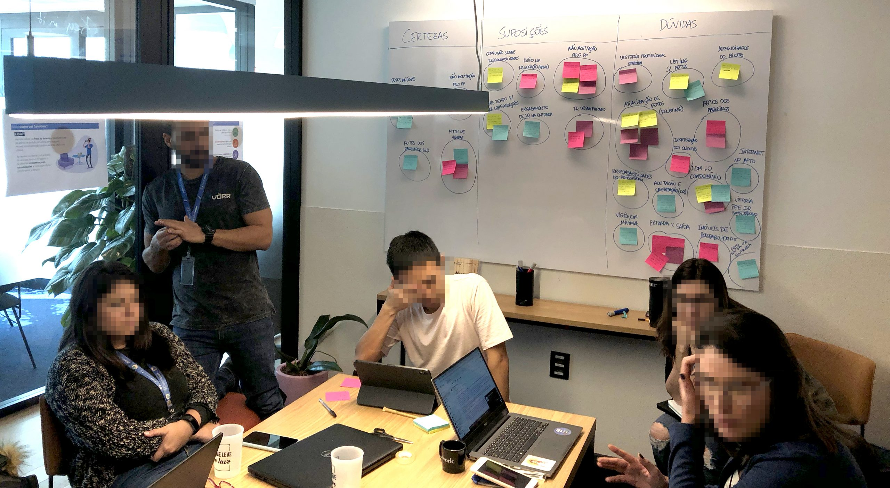
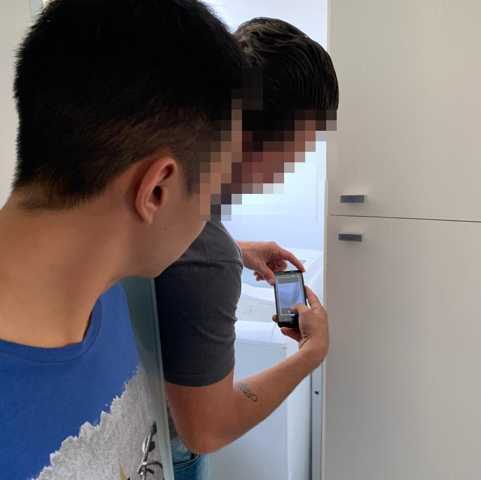
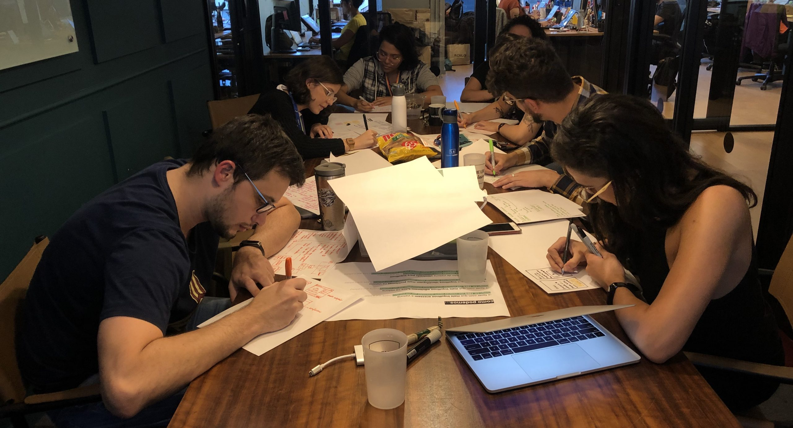
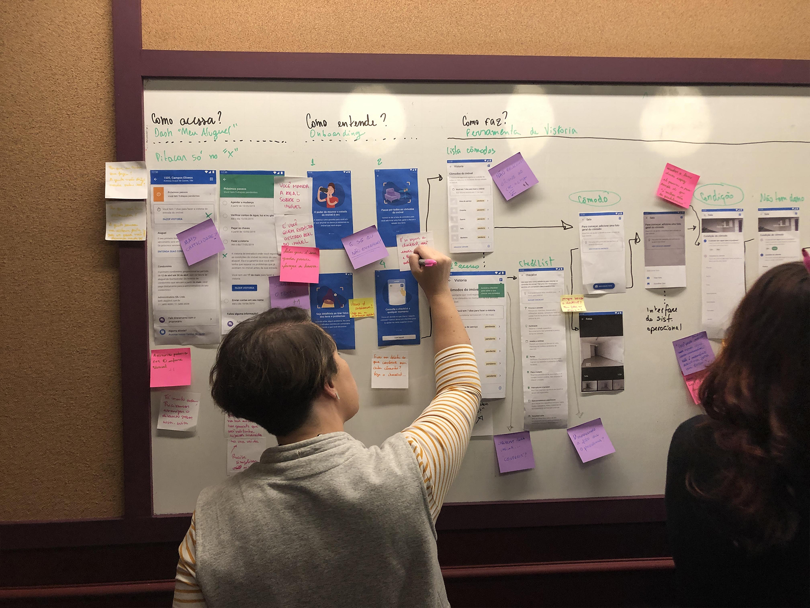
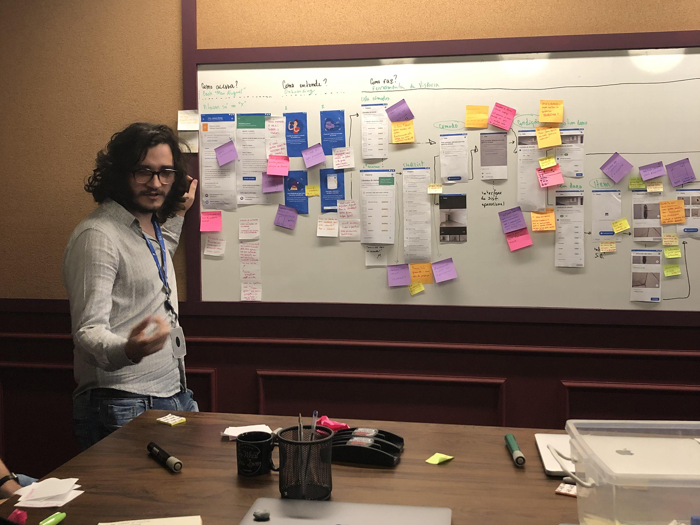
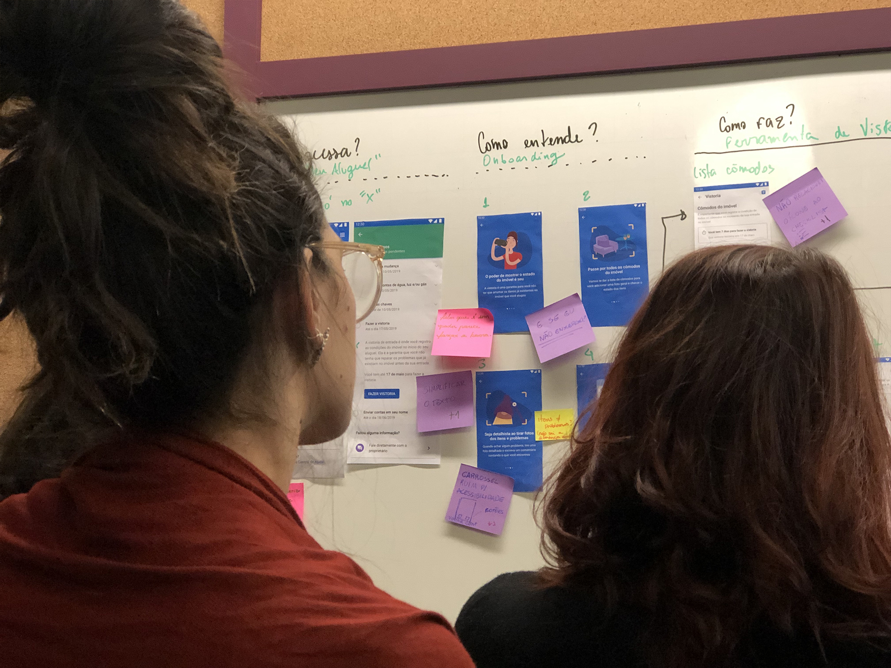
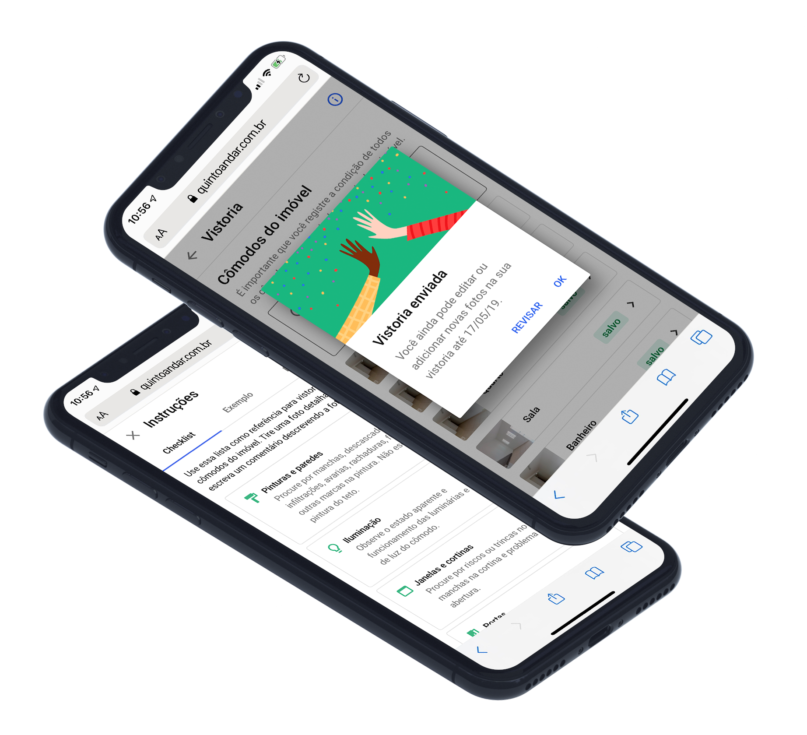

import { Grid } from "@material-ui/core"

<Grid container justify="center" spacing={5}>

<Grid item lg={4}>

### Problem

Home inspections costs were increasing our cost-to-serve and worsening unit economics.

</Grid>

<Grid item lg={4}>

### Solution

Empowering tenants to inspect their new homes with a self-service tool.

</Grid>

<Grid item lg={4}>

### Role

Bring the user's perspective into a business-centered discussion through design.

</Grid>
</Grid>

---

<Grid container justify="center">
<Grid item lg={8}>

I decided to start my discovery with three steps which included qualitative research with tenants, inspectors and a workshop with stakeholders:

1. In-depth interviews: scripted, 30-minute calls with 10 tenants who had recently moved in.

1. Contextual inquiries: observing and interviewing three professional inspectors while they inspected real properties.

1. CSD workshop: a series of workshops to gather information from stakeholders and operational teams through "certainties, assumptions and doubts" (CSD) on the inspection process.

</Grid>

<Grid item lg={12}>

</Grid>

<Grid item lg={8}>

These steps allowed me and my team to understand:

1. What was a professional inspector's mental model while inspecting a property so as to bring a similar model for tenants.

1. What were tenants' pain points with the move-in inspection and how we could empower them with a self-service application.

After I gathered enough information on inspections, I kicked off the solution with an ideation workshop so as to bring other product designers and make it a collaborative process.

</Grid>

<Grid item lg={12}>

</Grid>

<Grid item lg={8}>

This allowed me to quickly have a few ideas to prototype a solution, bring it to a design critique and test it with users within a week and a half. At the end, my process involved the following steps:

1. Design jam: a 2-hour workshop with 7 product designers going through How Might We, Crazy 8s and other ideation exercises.

1. Design critique: a 1-hour critique session to gather feedback from other product designers on design system usage, writing and accessibility.

1. Usability testing: a task-based usability test with 5 recruited users to test our solution out.

</Grid>

<Grid item lg={12}>

</Grid>
</Grid>